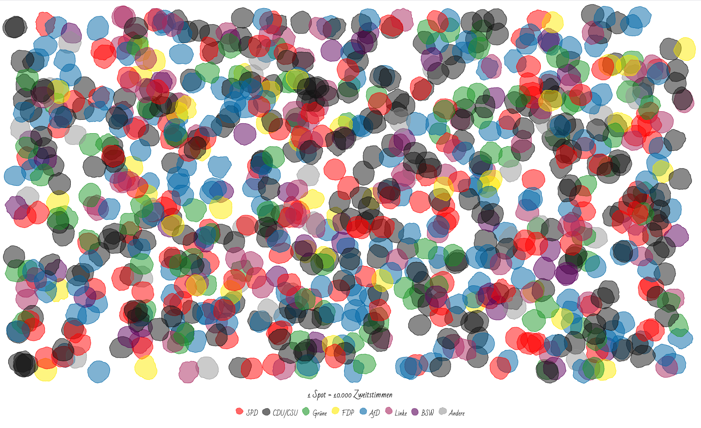
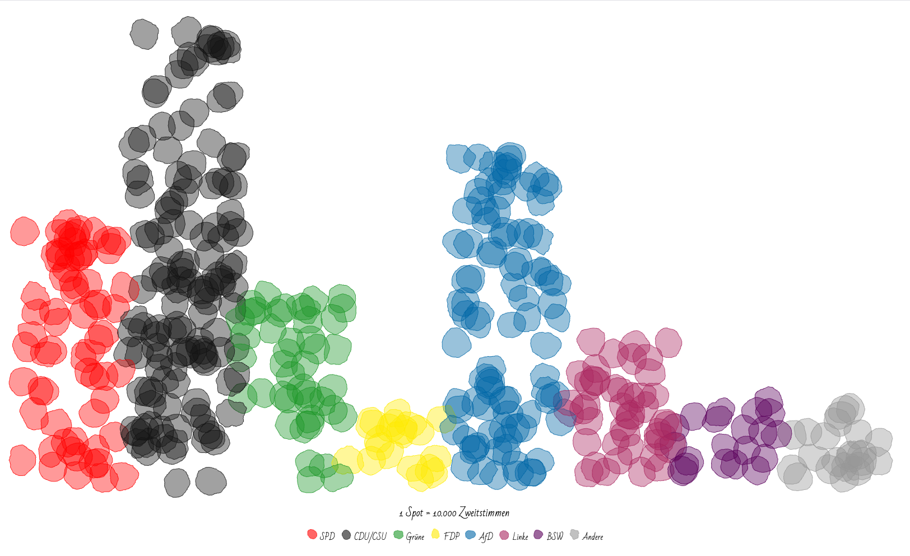

# Voting Spots - Imperfect Circles

Code for animated visualization in blog post: https://blog.kristin-baumann.com/voting-spots-imperfect-circles-vis/

Details:

- uses Canvas API & D3
- two display options: distributed or in histogram shape (see index.js)
- algorithm for imperfect circles by Dan Gries

## Screenshots

Display option "distributed"

Display option "histogram"
